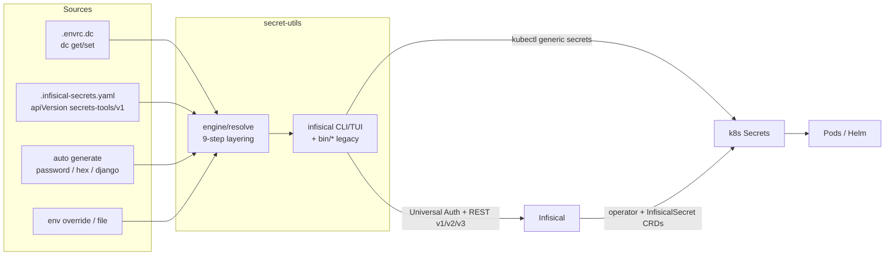

# secret-utils Architecture

## Overview

DevOps utility for secrets management on the Noizu k8s platform: local env-file
hydration (`hydrate-envrc`) and full-lifecycle Infisical ops (populate, fetch,
verify, set, audit, rebuild, bootstrap, export, view-dc, find-dc-line).

Two generations coexist:

| Generation | Surface | Role |
|------------|---------|------|
| **Rust** (`rust/`) | Single `infisical` binary (clap + ratatui, tokio/reqwest) | Primary install target when `cargo` is present |
| **Bash** (`bin/` + `lib/secret-engine.sh`) | 11 per-op scripts | Always installed as fallback / cargo-free path; `hydrate-envrc` is shell-only |

The package keeps three sources aligned: direnv-config (`.envrc.dc` via `dc
get/set --reveal`), declarative definitions (typically
`.infisical-secrets.yaml`), and the self-hosted Infisical API. Downstream,
InfisicalSecret CRDs (Terraform `platform/*`) + the Infisical operator materialize
k8s Secrets for Helm.

## System Diagram



## Core Components

| Component | Purpose |
|-----------|---------|
| `rust/src/main.rs` + `cli.rs` | Entry + clap subcommands: `audit`, `bootstrap`, `fetch`, `find-dc-line`, `populate`, `rebuild`, `set`, `verify`, `view-dc` |
| `rust/src/api/` | `InfisicalClient`: Universal Auth login, list/get/set secrets (v3 raw), folder ensure (v2), optional CF Access headers |
| `rust/src/engine/resolve.rs` | Per-spec value resolution (see layering below) |
| `rust/src/engine/generate.rs` | `AutoKind::{Password,Hex,Django}` via `rand` |
| `rust/src/engine/mod.rs` | Verify engine: dc value vs Infisical value → `VerifyStatus` |
| `rust/src/config/` | Load `secrets-tools/v1` or legacy YAML; `discover_config` walks parents |
| `rust/src/dc.rs` | `dc get … --reveal --raw` wrapper; refuses redaction sentinels; `.envrc.dc` parse/find |
| `rust/src/commands/` | One module per subcommand; shared `creds::build_client` |
| `rust/src/tui/` | ratatui views for populate / fetch / verify progress |
| `bin/*` (11) | Legacy CLIs; installed by `make install-legacy` always (with or without Rust) |
| `lib/secret-engine.sh` | Shared Bash: auth, get/set/list, YAML parse, envrc.dc edit, resolve, verify → `~/.local/lib` |
| `bin/hydrate-envrc` | Two-pass `.envrc.example` → `.envrc` (`generate:*`, `inherit:`, `REQUIRED`) |
| `Makefile` | `compile` / `test` / `install` / `install-legacy` / `clean` |

## Resolution Layering

Authoritative order in `engine/resolve.rs` → `resolve_spec` (first non-empty wins):

1. **`override`** — named env var (migration / forced value)
2. **`dc`** — `dc get <scope> <path> --reveal --raw`
3. **`env`** — plain env var
4. **`ref`** — already-resolved section `vars` map entry
5. **`template`** — `{{VAR}}` / `{{VAR|urlencode}}` against resolved vars
6. **`file`** — read path (trim)
7. **`fallback_dc`** — secondary dc ref
8. **`auto`** — generate password / hex / django
9. **`default`** — static string
10. **`optional: true`** → `None` without error; else `None` (caller may warn)

Optional `decode: base64` runs after the chosen source. Populate runs **Phase A**
(resolve section `vars`) then **Phase B** (resolve + `set_secret` each secret).

## Command Map

| Op | Rust | Bash | Behavior (code-level) |
|----|------|------|------------------------|
| populate | `infisical populate` | `infisical-populate-secrets` | Ensure folders; resolve; create/patch/skip via GET+POST/PATCH; `--section` / groups; `--dry-run` / `--show-secrets` / `--impacted` |
| verify | `infisical verify` | `infisical-verify` | For each YAML secret with dc (or fallback_dc): compare dc vs Infisical |
| audit | `infisical audit` | `infisical-audit` | Cross-source audit report (markdown/json) |
| set | `infisical set <name>` | `infisical-set-secret` | Update dc + Infisical (prompt / `--value` / `--generate`) |
| fetch | `infisical fetch <path>` | `infisical-fetch-secrets` | List secrets at Infisical path (table/env/json) |
| rebuild | `infisical rebuild` | `infisical-rebuild` | Phases scan → analyze → generate (optional) into `.rebuild/` |
| bootstrap | `infisical bootstrap` | `infisical-bootstrap` | `kubectl` generic + TLS secrets for Infisical itself (tier-0 chicken-and-egg) |
| view-dc / find-dc-line | yes | yes | Inspect / locate `dc get` lines in `.envrc.dc` |
| hydrate-envrc | — | `hydrate-envrc` | Local `.envrc` generation only |
| export | — | `export-infisical-secrets` | Export helper (shell) |

Env selection: `--prod` / `--stage` / `--dev` / `--env`, default **`prod`**.

## Config Discovery

`discover_config` (and shell `secrets_find_config`):

1. Explicit `-c` / `--config`
2. `INFISICAL_SECRETS_FILE`
3. Walk CWD→parents for: `.infisical-secrets.yaml`, `.infra-config.yaml`,
   `infisical-secrets.yaml`, `secrets.yaml`

V1 detection: body contains `apiVersion: secrets-tools/v1`. Schema units:

- **Section** — `id`, `title`, `path` (Infisical folder), `vars`, `secrets`
- **SecretSpec** — fields listed under Resolution Layering
- **Groups** — named lists of section ids for `--section <group>`

Example topology: `secrets.yaml.example`. Platform inventory of service folders
(and multi-folder fan-out) lives in [arch/secret-topology.md](arch/secret-topology.md).

## Auth & Credentials

`commands/creds.rs` / shell `infisical_auth`:

| Need | Sources (first hit) |
|------|---------------------|
| Host | `INFISICAL_HOST` / `K8_INFISICAL_HOST` / `dc get secrets infisical.host` |
| Project | `INFISICAL_PROJECT_ID` or slug → `/api/v1/projects/slug/{slug}` |
| Operator | `EKS_OPERATOR_CLIENT_ID|_SECRET` or `K8_INFISICAL_CLIENT_ID|_SECRET` / `dc … operator.client_*` |
| CF Access (optional) | `CF_ACCESS_CLIENT_ID|_SECRET` / `dc get cf access.*` |

Login: `POST …/api/v1/auth/universal-auth/login` → bearer for subsequent calls.
`dc_get` **must** use `--reveal`; redaction masks (`**redacted**`) are rejected
so populate never writes placeholders into Infisical (`tests/test_populate_redaction.sh`).

## Data Flow (populate / verify)

1. Load YAML → select sections (all / id / group).
2. Connect Infisical client for target env.
3. **Populate**: `ensure_folder` per path segment (409 = ok) → resolve vars →
   resolve secrets → `set_secret` (unchanged / create / update / dry-run would-*).
4. **Verify**: YAML enumerates secrets; status from presence+equality of dc vs
   Infisical (`ok`, `mismatch`, `missing_dc`, `missing_infisical`, `missing_all`,
   `missing_yaml` reserved).
5. **Rebuild**: inventory live Infisical (hashes; values only with
   `--show-secrets`) → analyze → optionally emit repaired local files under
   `--output-dir` (default `.rebuild`).

Detail notes: [arch/data-flow.md](arch/data-flow.md) (hydrate + shell populate).

## Install & Ecosystem

```text
make compile          # cargo build --release (skip if no cargo)
make test             # shell redaction + selected cargo tests
make install          # install infisical (if cargo) + always install-legacy
make install-legacy   # 11 bin/* + secret-engine.sh → ~/.local/lib
```

Repo-root `make install-utilities` also installs this package. Credentials and
host typically come from monorepo `.envrc.k8.dc` / Infisical sections of
`.infra-config.yaml`. Tier-0 deployment path: populate Infisical → CRDs/operator
→ k8s Secrets → Helm.

## Key Decisions

| Decision | Rationale |
|----------|-----------|
| Rust primary + shell always installed | Typed async engine + TUI; cargo-free ops and `hydrate-envrc` remain |
| REST API (not Infisical CLI) | Per-secret create/patch/skip, folder ensure, dry-run outcomes |
| Multi-source + verify/audit/rebuild | Drift is expected; repair is first-class |
| override before dc | Migrations and break-glass without rewriting `.envrc.dc` |
| `--reveal` + redaction guard | Prevent silent corruption of Infisical with masked values |
| Folder-per-section path | 1:1 with InfisicalSecret CRD / service topology |
| Bootstrap via kubectl | Infisical cannot seed its own DB/encryption secrets |

## Technology Stack

| Layer | Stack |
|-------|--------|
| Primary CLI | Rust 2021 — clap 4, tokio, reqwest (rustls), serde_yaml/json, ratatui/crossterm, indicatif, rand, sha2 |
| Legacy | Bash `set -euo pipefail`, curl, jq, openssl; `dc` CLI |
| API | Infisical Universal Auth + secrets raw v3 + folders v2 |
| Target | Self-hosted Infisical → k8s Secrets (operator + bootstrap) |

## Related Docs

- [arch/data-flow.md](arch/data-flow.md) — hydrate + populate steps
- [arch/secret-topology.md](arch/secret-topology.md) — platform folder map / fan-out
- [PROJ-SCHEMA.md](PROJ-SCHEMA.md) — config/data artifact schemas (no DB)
- [layout/rust.md](layout/rust.md), [layout/bin.md](layout/bin.md)
- [PROJ-HOWTO.md](PROJ-HOWTO.md), [PROJ-FAQ.md](PROJ-FAQ.md)
- Package [README.md](../README.md)
