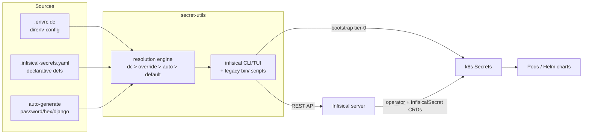

# k8/secret-utils Architecture

## Overview

Terminal utility package for secrets management across the Noizu k8s platform:
local environment-file generation (`hydrate-envrc`) and full-lifecycle
Infisical secret operations (populate, fetch, verify, set, audit, rebuild,
bootstrap, export). It has two generations of tooling — 11 legacy Bash CLIs
(`bin/` + `lib/secret-engine.sh`) and a Rust rewrite (`rust/`) that ships a
single `infisical` binary (clap CLI + ratatui TUI) exposing the same
operations as subcommands.

The package sits between three secret sources it keeps in sync: direnv-config
(`.envrc.dc`, via `dc get/set`), the declarative definitions file
(`.infisical-secrets.yaml` at repo root), and the self-hosted Infisical
server. Downstream, Infisical's k8s operator materializes those secrets into
k8s Secret resources via InfisicalSecret CRDs deployed by Terraform.

## System Diagram

## Core Components

| Component | Purpose |
|-----------|---------|
| `rust/` — `infisical` binary | Primary tool: `audit`, `bootstrap`, `fetch`, `find-dc-line`, `populate`, `rebuild`, `set`, `verify`, `view-dc` subcommands; ratatui progress/result views; tokio + reqwest Infisical API client with Universal Auth |
| `rust/src/engine/` | Secret resolution engine — source layering (dc → env override → auto-generate → default) and value generation |
| `rust/src/config/` | Secret-definition loading; `v1` schema plus `legacy` schema support |
| `bin/` (11 shell CLIs) | Legacy per-operation scripts (`hydrate-envrc`, `infisical-populate-secrets`, `infisical-verify`, …); installed only when `cargo` is unavailable or via `make install-legacy` |
| `lib/secret-engine.sh` | Shared shell library sourced by all `bin/` scripts: Infisical API client, secrets-YAML parser, `.envrc.dc` parser/editor, verification engine; installed to `~/.local/lib` |
| `bin/hydrate-envrc` | Two-pass `.envrc.example` → `.envrc` template processor with `generate:password|hex|django`, `inherit:VAR`, and `REQUIRED` directives |
| `Makefile` | `compile`/`test`/`install`; builds the Rust binary and installs it (plus legacy scripts) to `~/.local/bin` |

## Data Flow

Secrets flow through resolution, population, and verification stages.
`hydrate-envrc` does a two-pass parse to resolve forward `inherit:`
references. Populate authenticates via Infisical Universal Auth, provisions
folders idempotently, then creates/patches/skips each secret with parallel
writes; verify compares the three sources (`.infisical-secrets.yaml`,
`.envrc.dc`, live Infisical) and audit/rebuild report on or repair drift.

→ *See [arch/data-flow.md](arch/data-flow.md) for details*

## Secret Organization

Infisical secrets live in 18 service-scoped folders (`/mysqldb`, `/backend`,
`/timescaledb`, `/redis`, `/valkey`, …) mirroring the k8s service topology,
with prod/staging/dev environments. Some values are fanned out to multiple
folders under different key names (e.g. `APP_BACKEND_DB_PASSWORD` appears in
`/timescaledb`, `/backend`, and `/proxysql`).

→ *See [arch/secret-topology.md](arch/secret-topology.md) for details*

## Ecosystem Fit

- **Install**: `make install` here, or repo-root `make install-utilities`,
  places binaries in `~/.local/bin` alongside the other Noizu DevOps tools.
- **Config**: reads repo-level `infra-config.yaml` (`infisical.host`,
  `project_id`, `infisical_bootstrap` stanza) per the monorepo's
  `.infra-config.yaml` single-source-of-truth convention; credentials come
  from the `.envrc.k8.dc` direnv-config layer (`K8_INFISICAL_CLIENT_ID`/`_SECRET`).
- **k8-lib**: legacy scripts follow the shared `share/k8-lib` utility
  conventions (README at `~/.local/share/k8-lib/`); this package additionally
  ships its own `secret-engine.sh` to `~/.local/lib`.
- **Downstream**: feeds the platform secrets flow — definitions →
  Infisical → InfisicalSecret CRDs (Terraform `platform/*` modules) →
  k8s Secrets → Helm charts (deployment tier 0).

## Key Decisions

- **Rust rewrite over shell**: single typed binary with async parallel API
  calls, TUI feedback, and testable engine code; legacy scripts retained as a
  cargo-free fallback (`make install` auto-detects).
- **Three-source chain with verify/audit**: dc, declarative YAML, and
  Infisical are deliberately redundant; `verify`/`audit`/`rebuild` exist to
  detect and repair drift rather than assuming a single writer.
- **Env layering (dc → override → auto → default)**: every secret can be
  auto-generated for fresh installs yet overridden for migrations.
- **Folder-per-service in Infisical**: maps 1:1 to InfisicalSecret CRD
  targeting per k8s service/namespace.
- **Tier-0 bootstrap script**: Infisical can't manage its own prerequisites,
  so `bootstrap` pre-creates its k8s Secrets (chicken-and-egg).
- **Infisical REST API over its CLI**: parallel writes and per-secret
  create/patch/skip error handling.

## Technology Stack

| Layer | Technology |
|-------|------------|
| Primary CLI | Rust — clap, tokio, reqwest, serde, ratatui |
| Legacy CLIs | Bash (`set -euo pipefail`) + `lib/secret-engine.sh` |
| Crypto/generation | OpenSSL rand, Python secrets (django keys); Rust `engine/generate` |
| API | Infisical v1/v2/v3 REST, Universal Auth bearer tokens |
| Secret backend | Infisical (self-hosted, infisical.noizu.com) |
| Target | Kubernetes via InfisicalSecret CRDs + tier-0 bootstrap Secrets |
