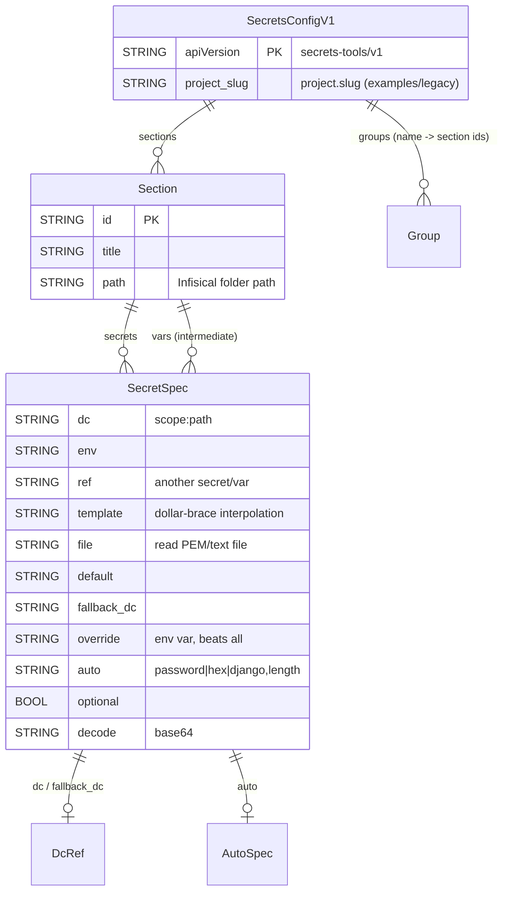

# Project Schema — k8/secret-utils

**No persistence layer.** This package has no database, no SQL schema, and no
Liquibase changelogs. Its tools are stateless CLIs: they *read* declarative
config, *resolve* values from external sources, and *write* to the Infisical
API or generated env files. There are no local state files — nothing is
persisted by the tools themselves.

This document therefore covers the **config / data artifacts** the package
defines or consumes (structure only — never secret values):

1. `secrets.yaml` — declarative secret-definition schema (`secrets-tools/v1`)
2. `.envrc.dc` / direnv-config store — subject/path/layers structure
3. Infisical project layout — folder paths, credentials, env
4. File-based sources — TLS PEM files
5. Generated outputs — `.envrc`, k8s Secrets (downstream, not owned here)

Arch context: [PROJ-ARCH.md](PROJ-ARCH.md) · Topology details:
[arch/secret-topology.md](arch/secret-topology.md).

---

## 1. `secrets.yaml` — declarative definitions (v1)

Authoritative parser: `rust/src/config/v1.rs` (`SecretsConfigV1`).
Canonical shape: [secrets.yaml.example](../secrets.yaml.example) (copy →
`.infisical-secrets.yaml` at monorepo root). A legacy shell-schema variant is
still accepted by `rust/src/config/legacy.rs`.



```plantuml
@startuml
skinparam linetype ortho

TABLE(SecretsConfigV1) {
  * apiVersion : "secrets-tools/v1" <<PK>>
  --
  project_slug : STRING
}

TABLE(Section) {
  * id : STRING <<PK>>
  --
  * title : STRING
  * path : STRING "Infisical folder"
}

TABLE(SecretSpec) {
  dc : DcRef "scope:path"
  env : STRING
  ref : STRING
  template : STRING
  file : STRING
  default : STRING
  fallback_dc : DcRef
  override : STRING
  auto : AutoSpec "password|hex|django"
  optional : BOOL
  decode : STRING "base64"
}

TABLE(DcRef) {
  * scope : STRING <<PK>>
  * path : STRING <<PK>>
}

TABLE(AutoSpec) {
  * type : "password|hex|django" <<PK>>
  --
  length : INT "= 32"
}

SecretsConfigV1 ||--o{ Section : sections
Section ||--o{ SecretSpec : secrets+vars
SecretSpec ||--o| DcRef : dc/fallback_dc
SecretSpec ||--o| AutoSpec : auto
@enduml
```

### Top level

| Field | Type | Required | Description |
|-------|------|----------|-------------|
| `apiVersion` | string | Yes | Must be `secrets-tools/v1` (legacy parser for older files) |
| `project` | map | No | `slug` — Infisical project identity (example/legacy use) |
| `sections` | list | Yes | One entry per Infisical folder (below) |
| `groups` | map name → [section ids] | No | Named bundles for `--section` filtering |
| `templates` | YAML anchors | No | Reusable blocks merged via `<<: *anchor` |

### `sections[]`

| Field | Type | Required | Description |
|-------|------|----------|-------------|
| `id` | string | Yes | Section identifier (referenced by groups) |
| `title` | string | Yes | Human label |
| `path` | string | Yes | Infisical folder path, e.g. `/data/postgres` |
| `vars` | map name → SecretSpec | No | Intermediate values (prefixed `_` by convention), not uploaded |
| `secrets` | map name → SecretSpec | No | Secrets pushed to `path` |

### `SecretSpec` value resolution

Sources are mutually combinable; precedence (authoritative order in
`engine/resolve.rs` → `resolve_spec`, first non-empty wins):

`override` env → `dc` → `env` → `ref` → `template` → `file` → `fallback_dc`
→ `auto` generation → `default`. `optional: true` makes a missing value
non-fatal; `decode: base64` post-processes fetched values; `template`
interpolates `{{var}}` from vars/secrets (supports `{{var|urlencode}}`).

| Field | Shape | Notes |
|-------|-------|-------|
| `dc` / `fallback_dc` | `{scope, path}` | `dc get <scope> <path>`; `scope: auto` + `auto:` = generate-if-missing |
| `env` | string | Env-var name |
| `ref` | string | Name of another var/secret in same section |
| `template` | string | `{{name}}` interpolation |
| `file` | string | Path to PEM/text file (e.g. `.secrets/tls/<domain>/cert.pem`) |
| `override` | string | Env var that wins over everything |
| `auto` | `{type, length}` | `type`: `password` \| `hex` \| `django`; `length` default 32 |
| `default` | string | Static fallback |
| `optional` | bool | Default false |
| `decode` | string | e.g. `base64` |

---

## 2. direnv-config store (`.envrc.dc`)

Canonical example: [envrc.dc.example](../envrc.dc.example). The dc store is a
set of **subjects**, each with optional **layers** (notably `secrets`), defined
via `dc_yaml <subject> [--layer secrets]` heredocs in `.envrc.dc`.

| Subject | Layer(s) | Role |
|---------|----------|------|
| `infra` | base | Repo root, k8-lib dir, build env |
| `cluster` | base | kubeconfig path, context |
| `cf` | base + secrets | Cloudflare account/zone/token, Namecheap |
| `secrets` | secrets | **Central secret definitions** — `infisical.*`, `operator.*`, `smtp.*`, `sendgrid.<svc>`, `registry.*`, `github.token`, `hf.read_token` |
| `platform` | base + secrets | MinIO root, Keygen, Verdaccio, Weaviate, DNS zone ids |
| `services` | secrets | Per-service DB/Redis/OAuth secrets (`telemetry`, `signoz`, `livebook`, `bob`, `design`, `apps`, `mail`, `operations`, `svc`) |
| `auto` | secrets (`--if-missing`) | Auto-generated values referenced as `dc: auto <name>` |
| `tab` | base | Shell theming (optional) |
| `_dc` | meta | `export:` allowlist + `flatten:` subject.path → ENV_VAR rules |

Access patterns used by this package: `dc get <subject> <path>` (masked),
`dc get --reveal --raw` (capture), `dc config get/set`, `dc compare`. Secret
values are `<SECRET>` placeholders in the example — never committed.

## 3. Infisical project layout

- **Host/API**: `secrets.infisical.host` (e.g. `https://infisical.noizu.com/api`)
- **Project**: `project_id` / `project_slug` from monorepo `.infra-config.yaml`
  (`infisical` stanza); env `prod`
- **Credentials**: Universal Auth client id/secret in `.envrc.k8.dc`
  (`K8_INFISICAL_CLIENT_ID` / `K8_INFISICAL_CLIENT_SECRET`) — see
  [envrc.dc.example](../envrc.dc.example) template
- **Folder paths**: one per `sections[].path`; convention `/data/*` (databases),
  `/apps/<app>`, `/shared/*` (TLS). The monorepo root `.infisical-secrets.yaml`
  defines the live tree (see [arch/secret-topology.md](arch/secret-topology.md)
  for cross-folder duplication patterns)
- **Downstream**: Infisical k8s operator syncs folders → k8s Secrets
  (`InfisicalSecret` CRDs, terraform-managed — not this package)

## 4. File-based sources

| Path | Format | Used by |
|------|--------|---------|
| `.secrets/tls/<domain>/cert.pem` / `key.pem` | PEM | `file:` specs (`TLS_CRT`/`TLS_KEY`, `decode: base64`) |
| `envrc.dc.example`, `secrets.yaml.example` | in-repo templates | Copy/merge targets (checked in; real files gitignored) |

## 5. Generated outputs (not owned by this repo)

| Artifact | Producer | Consumer |
|----------|----------|----------|
| `.envrc` (project-local) | `hydrate-envrc` / `infisical populate` `generate:*` blocks | direnv |
| k8s Secrets (tier-0) | `infisical bootstrap` | pods, pre-operator |
| Infisical folder contents | `infisical populate` / `set` | operator → k8s Secrets |

## Migration history

None — no migrations. Schema evolution is versioned by `apiVersion`
(`secrets-tools/v1` current; `config/legacy.rs` reads pre-v1 files). Format
changes land as a new `apiVersion` + parser module.
