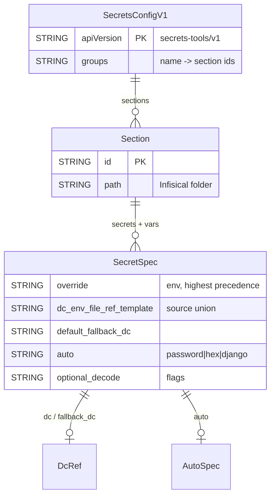

# Project Schema Summary — k8/secret-utils

**No persistence layer** — no DB/SQL/Liquibase. Stateless CLIs over external
stores. Full reference: [PROJ-SCHEMA.md](PROJ-SCHEMA.md).

Artifacts covered:

| Artifact | Kind | Owner |
|----------|------|-------|
| `secrets.yaml` (`secrets-tools/v1`) | Declarative secret-definition config | this package (parser `rust/src/config/v1.rs`) |
| `.envrc.dc` dc store | Subjects × layers (base/`secrets`), `auto` gen values | direnv-config (format shared) |
| Infisical folders | `sections[].path` tree (`/data/*`, `/apps/*`, `/shared/*`), env `prod` | external Infisical server |
| `.secrets/tls/<domain>/*.pem` | PEM files via `file:` + `decode: base64` | filesystem (gitignored) |
| `.envrc`, k8s Secrets | Generated outputs | downstream consumers |

Key resolution order (per `engine/resolve.rs`): `override` → `dc` → `env` →
`ref` → `template` → `file` → `fallback_dc` → `auto` (`length` default 32) →
`default`; `optional: true` tolerates missing; templates interpolate `{{var}}`
(+ `|urlencode`).

dc subjects this package reads: `secrets` (central defs), `auto`
(generated), plus `platform`/`services` paths; creds for Infisical UA live in
`.envrc.k8.dc` (`K8_INFISICAL_CLIENT_ID`/`_SECRET`). No secret values are
stored in this repo — only the two `*.example` templates.
